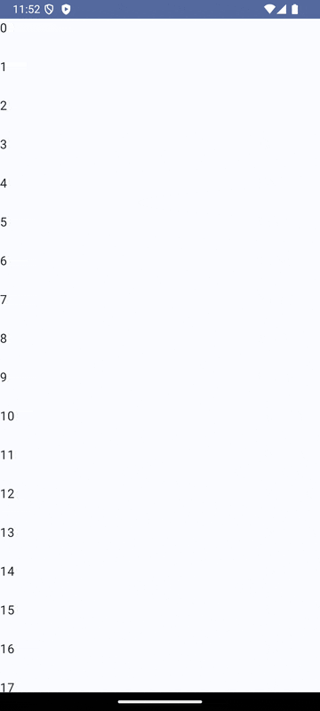

# Pull to refresh Module




# 어떻게 스크롤 했을 때 화면을 아래로 끌어당길수 있는가?


NestedScrollConnection


## 1. 사용자 입력 감지 (Drag 동작)
- PullRefreshNestedScrollConnection 클래스가 nestedScroll 메커니즘을 통해 사용자의 스크롤 동작을 감지합니다.
- onPreScroll: 사용자가 위로 스크롤(available.y < 0)할 때 호출.
- onPostScroll: 사용자가 아래로 당기기 시작(available.y > 0)하면 호출.
- onPull 메서드가 호출되어 사용자가 당긴 거리를 계산하고 상태를 업데이트합니다.


리프레시 인디케이터 상태는 4가지

```
/**
 * 리프레시 인디케이터 상태
 */
enum class RefreshIndicatorState {
    /** 기본 */
    Default,

    /** 당김 */
    PullingDown,

    /** 이벤트 요청 도달 */
    ReachedThreshold,

    /** 요청 중 */
    Refreshing
}
```

